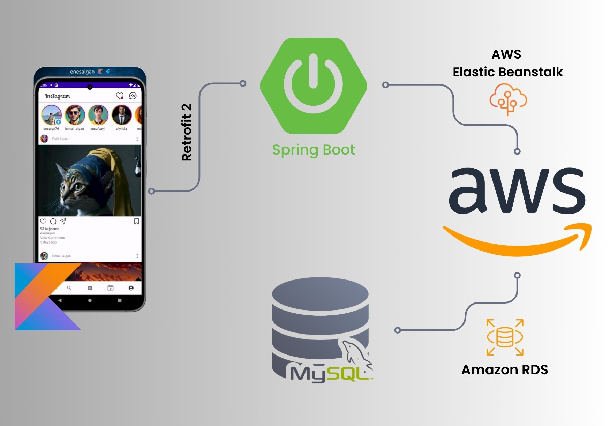
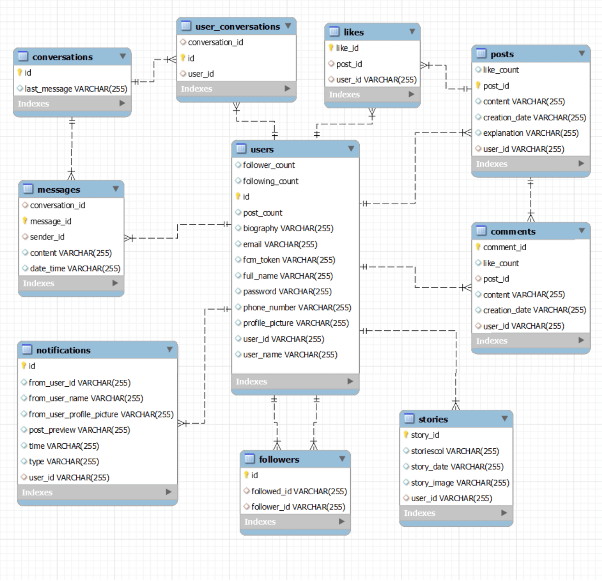

# Instagram Clone Backend (Spring Boot)

This project is the backend component of an Instagram clone developed using Spring Boot. It serves as the API for the Instagram clone frontend, handling user authentication, post management, and other backend functionalities.

## Frontend Project

The frontend of this Instagram clone application is developed separately. You can find the frontend project on GitHub:

[Kotlin Frontend Project](https://github.com/EnesAlgan76/Kotlin_InstagramClone)

## Application Overview


## Features

- User authentication and authorization
- Post management (creation, deletion, updating)
- Follow/Unfollow functionality
- Like and comment on posts
- Profile management
- ... and more

## Technologies Used

- Spring Boot (Java)
- MySQL
- Amazon Elastic Beanstalk
- Amazon RDS


## Configuration

- The database connection details can be configured in the `application.properties` file.
- Ensure that environment variables are properly set up for deployment to Amazon Elastic Beanstalk.

```properties
# LOCAL HOST CONFIGURATION
# Uncomment these lines and comment out the AWS configuration when running locally
spring.datasource.url=jdbc:mysql://localhost:3306/enesdb
spring.datasource.username=root
spring.datasource.password=123456
spring.datasource.driver-class-name=com.mysql.cj.jdbc.Driver
spring.jpa.show-sql=true
spring.jpa.hibernate.ddl-auto=create
spring.jpa.properties.hibernate.dialect=org.hibernate.dialect.MySQLDialect

# AWS CONFIGURATION
# Uncomment these lines and comment out the local configuration when deploying to AWS
server.port=5000
spring.datasource.url=jdbc:mysql://AWS_RDS_ENDPOINT:3306/enesdb
spring.datasource.username=AWS_DB_USERNAME
spring.datasource.password=AWS_DB_PASSWORD
spring.datasource.driver-class-name=com.mysql.cj.jdbc.Driver
spring.jpa.show-sql=true
spring.jpa.hibernate.ddl-auto=update
spring.jpa.properties.hibernate.dialect=org.hibernate.dialect.MySQLDialect

```
-
Replace `AWS_RDS_ENDPOINT`, `AWS_DB_USERNAME`, and `AWS_DB_PASSWORD` with the actual values from your AWS RDS configuration.

## Database Diagram 



## Deployment

This project can be deployed to Amazon Elastic Beanstalk or any other suitable platform for Spring Boot applications.

